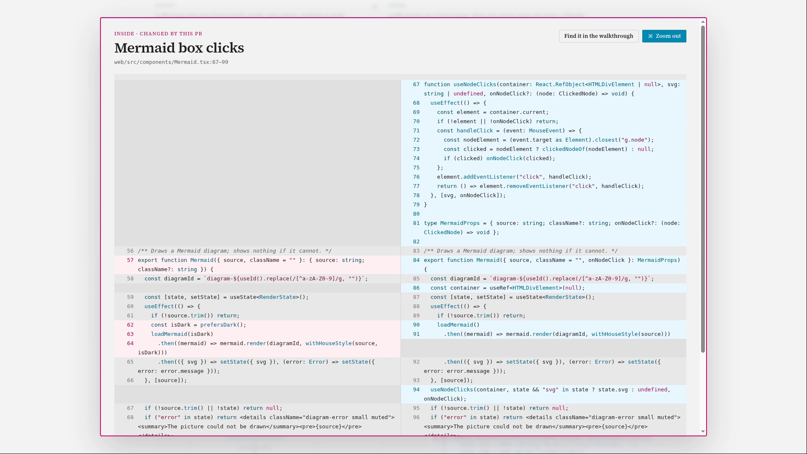
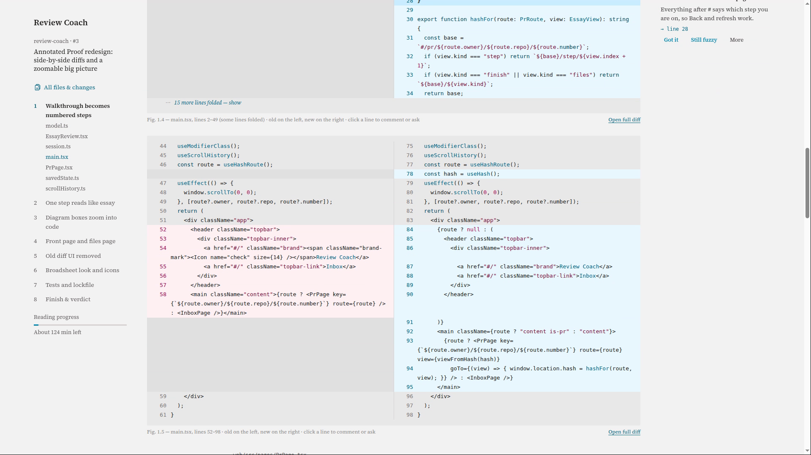
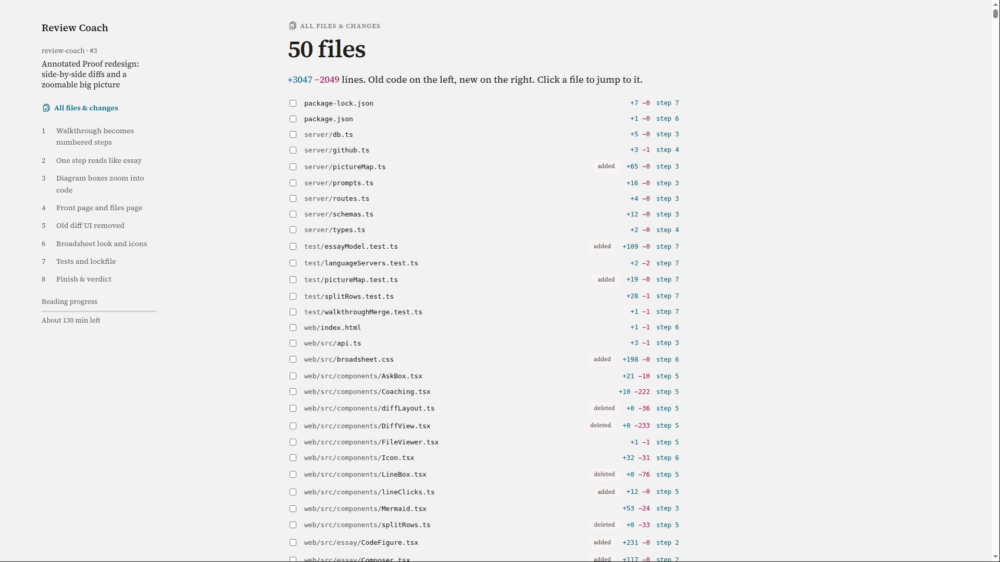

# Review Coach

A PR review inbox that coaches you through each review with Claude, instead of reviewing for you.

https://github.com/user-attachments/assets/1678edb3-a617-43aa-a9b6-fe573c1b0f66

<sub>A review in a minute: open a PR, zoom into the big picture, read a step, click a line to comment or ask.</sub>

## Install

```bash
curl -fsSL https://raw.githubusercontent.com/oleksii-dukhovenko/review-coach/master/install.sh | bash
```

That's it. It opens http://127.0.0.1:4477 when it's ready. **Run the same command to update.**

- You need [Docker](https://docs.docker.com/get-docker/), the [GitHub CLI](https://cli.github.com), and [Claude Code](https://docs.claude.com/en/docs/claude-code) with a Claude subscription.
- It asks you to log in to GitHub if you aren't, and to paste a Claude token once.
- It installs to `~/review-coach`. Set `REVIEW_COACH_DIR` to change that.
- On Windows, run it in WSL.

## What you get

- **An inbox** of PRs waiting on your review, plus your own drafts and PRs with comments waiting on you.
- **A front page per PR**: what it does in one line, where to spend your attention, and how long each step takes.
- **A big picture you can zoom into**: click a box in the diagram to see the code behind it.
- **Steps that read like an article**: plain text, code figures, and notes in the margin next to their line.
- **Side-by-side diffs** everywhere: old code on the left, new on the right.
- **Click any line** to add a review comment or ask Claude about it. Drag across several lines for a range.
- **Questions in the text** check you understood. Answer, click "Show me", or click "Explain".
- **All files & changes** on one page, with a checkbox per file.
- **Ctrl+click any name** to see where that exact thing is used, through real language servers for Go, Dart, and TypeScript.
- **New commits?** "Update" redoes only what changed and keeps your progress.

| Zoom into the big picture | Steps with side-by-side code |
| --- | --- |
| <a href="docs/media/zoom.png"></a> | <a href="docs/media/step.png"></a> |
| **All files & changes** | |
| <a href="docs/media/all-files.png"></a> | |

## Everyday commands

Run these in `~/review-coach`.

- **Stop**: `docker compose down`. **Start**: `docker compose up -d`
- **Logs**: `docker compose logs -f`
- **Wipe everything** (reviews, checkouts, chats): `docker compose down -v`

### If something goes wrong

- **"Could not reach GitHub"** on the page: your GitHub token expired. Run the install command again.
- **"Preparing is paused"**: Claude hit your usage limit. Click "Retry now" later.
- **It won't start**: `cd ~/review-coach && docker compose logs`.

<details>
<summary><strong>Run it without Docker, how it works, and settings</strong></summary>

### Run it without Docker

You need Node 24 or newer, git, `gh` logged in, and `claude` logged in.
For exact Ctrl+click in Go and Dart, also install `gopls` and the Dart or Flutter SDK.

```bash
git clone https://github.com/oleksii-dukhovenko/review-coach.git && cd review-coach
npm install && npm run build && npm start     # http://127.0.0.1:4477
```

- `npm run dev`: server with reload, plus Vite on port 4478.
- `npm test`: tests for the parts that do not use AI.
- `scripts/install-service.sh`: start it at login as a systemd user service.

### What is inside the Docker image

- git, `gh`, the `claude` CLI, Go with `gopls`, and the Dart SDK.
- Flutter packages from pub.dev are not inside, so Ctrl+click in Flutter code follows the repo's own code only.

### How it works

- Every 5 minutes it asks GitHub through `gh` for review requests and open comments on your PRs.
- Walkthroughs for review requests and your drafts, and triage for your comments, are prepared ahead, one at a time.
- Everything else waits until you click "Prepare".
- PRs are checked out into `~/.cache/review-coach/worktrees`, never your own clones.
- Claude runs as `claude -p` with read-only tools (`Read`, `Grep`, `Glob`), no MCP servers, and no hooks.
- A usage-limit error pauses preparing until you click "Retry now".
- A PR that gets new commits is marked "Out of date". Click "Update".
  - Or tick "Update on its own" on that PR, in the inbox or on its page. It is off by default for every PR.
  - When on, each GitHub check (every 5 minutes) updates that PR if it fell behind. A failed update waits for you.
- Update redoes only what changed:
  - files whose changes only shifted lines keep their notes and questions, moved to the new lines;
  - files with new changes go back to Claude, with their old stops, so still-valid questions keep their ids;
  - your answers, "Reviewed" checks, and draft comments carry over. Comments follow their line of code;
    if that code changed, the comment goes in the review summary instead;
  - comment triage looks only at threads that are new or got a reply.
- The page keeps showing your review while an update runs. A "Since you last looked" box says what changed.
- "Start over" at the top of a PR writes everything again from scratch.

### Make it yours

- **Who you are**: one line, so explanations fit your level.
  - Docker: `REVIEW_COACH_ABOUT_ME` in `.env`.
  - Without Docker: `~/.config/review-coach/profile.md`, or `REVIEW_COACH_PROFILE` pointing at a file.
- **How you like things explained**: sections of `~/AGENTS.md` (`REVIEW_COACH_RULES_FILE`) and `~/.claude/CLAUDE.md` (`REVIEW_COACH_GLOBAL_RULES_FILE`). Missing files are fine.
- **Learned concepts**: `REVIEW_COACH_CONCEPTS_DIR`. Default is the Obsidian folder `Documents/Obsidean/Round 2 POS/Code Reviews/Concepts` if it exists, else `~/.cache/review-coach/concepts`.
- **Faster first checkouts**: `REVIEW_COACH_PROJECTS_DIR`, a folder with your local clones. Default `~/ROUND_2_PROJECTS`.

### Settings

- `REVIEW_COACH_PORT`: default `4477`.
- `REVIEW_COACH_REPOS`: only watch these repos, comma-separated, e.g. `Round2POS/hyperion,Round2POS/crm`. Empty watches all.
- `REVIEW_COACH_DATA_DIR`: where checkouts and the database live. Default `~/.cache/review-coach`.
- `REVIEW_COACH_MODEL`: Claude model for walkthroughs and questions. Default is your Claude Code default.
- `REVIEW_COACH_TERMINAL`: terminal for the Neovim button, e.g. `ptyxis`, `kitty`, `alacritty`. Default is the first one installed. The button needs Neovim with diffview.nvim, and only works without Docker.
- `FLUTTER_ROOT`, `PUB_CACHE`: where Dart packages live. Defaults are `~/flutter` and `~/.pub-cache`.
- Language servers need `gopls` and `dart` on the service's `PATH`. The TypeScript server ships with this project.
- Dart checkouts get a generated `.dart_tool/package_config.json` from the lockfile and pub cache, so no network `pub get` is needed.

</details>
